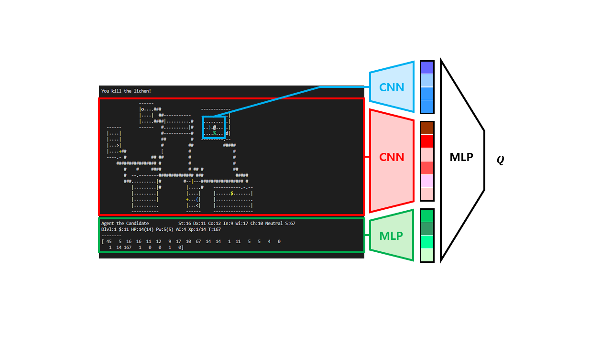

# 다섯 번째 예제

첫 번째 예제부터 네 번째 예제까지는 몇 가지 규칙을 정하고 그 규칙을 기반으로 action을 선택하여 진행하는 방식이었다. 다섯 번째 예제부터는 agent가 강화학습을 기반으로 action을 선택하도록 한다. 이번 예제에서는 DQN으로 action을 선택하는 모델을 구현한다.


Q-Learning은 추후 소개할 Actor-critic과 더불어 대표적인 model-free algorithm이다. Model-free algorithm이란, 환경에 대한 정보가 사전에 주어지지 않아 매시간 action을 통해 외부로부터 state, reward를 받아오는 알고리즘을 의미한다. 환경에 대한 정보가 없기 때문에 exploration을 통한 trial and error를 거치면서 reward를 최대로 하는 policy를 점차 학습한다. Q-Learning은 Finite Markov Decision Process를 기반으로 agent가 특정 state에 특정 action을 하라는 최적의 policy를 배우는 것으로, 현재 state에서 모든 sequential 단계를 거쳤을 때 전체 reward의 예측값을 최대화하는 action을 선택할 수 있도록 한다. Q-Learning에서는 Q-Table을 만들어 agent가 경험을 쌓아가면서 일정 주기마다 각 state에서의 Q 값을 갱신해 나가고, 최종적으로 최적의 Q-Table을 완성한다.


DQN은 기존의 Q-Learning 알고리즘을 신경망으로 바꾼 것이다. Q-Learning이 Q-Table의 값을 채워나가는 과정이라면 DQN은 Q-Table을 신경망으로 대체한 것이다. State와 action의 개수가 한정적이라면 Q-Table을 쉽게 만들 수 있기 때문에 Q-Learning을 적용할 수 있지만, 게임을 플레이하는 것처럼 수없이 많은 state와 action이 있다면 모든 경우에 대해 Q-Table을 최적화할 수 없을 것이다. 따라서 이런 경우 Q-Table 대신 신경망을 사용하는 DQN이 필요하다.

하지만 딥러닝과 강화학습은 데이터를 활용하는 방법에서 차이가 나기 때문에, 신경망을 바로 적용할 수는 없다. 대표적인 문제점으로 대부분의 딥러닝 알고리즘은 학습 데이터가 서로 독립적임을 가정하는데, 강화학습에 쓰이는 환경에서 제공하는 데이터는 연속된 행동에 대한 결과이기 때문에 서로 연관되어 있다. 즉, 독립적이지 않고 state간의 상관관계가 뚜렷하게 존재한다는 문제가 발생한다. 이를 해결하기 위해 DQN에서는 experience replay라는 개념을 사용한다. Experience replay란, 들어오는 입력을 순서대로 사용하면 데이터 간 연관성이 너무 커지므로 최근의 데이터를 계속해서 저장하고, 네트워크를 학습할 땐 저장한 데이터 중 몇 개를 무작위로 샘플하여 사용하는 방법이다. 이를 통해 앞에서 언급한 문제를 해결하였고, 딥러닝을 성공적으로 강화학습에 적용할 수 있었다. 이제 이를 NLE에서 구현하는 방법을 알아보자.



```dqn.py```에는 experience replay buffer와 DQN 모델이 구현되어 있다. Experience replay buffer에는 전처리 과정을 거친 현재 state의 맵의 정보와 agent의 blstat, 현재 state에서 선택한 action, 그에 대한 reward, 종료 여부, 전처리 과정을 거친 다음 state의 맵의 정보와 agent의 blstat 정보가 저장된다. Experience replay buffer의 자료구조로 deque를 사용하는데, deque은 double ended queue의 약자로 처음과 끝이 모두 열려있는 큐 형태를 의미한다. 이러한 형태 덕분에 처음과 끝에 새로운 요소를 추가하거나 기존의 요소를 삭제하는 것이 기존의 자료구조에 비해 월등히 빠르다는 장점이 있다. DQN 모델은 NLE 논문의 모델을 일부 참고하여 작성하였다. 현재 맵을 모두 사용하는 것이 아닌, agent의 현재 위치 주위의 일정 부분만 잘라서 입력으로 사용하도록 하였다. 입력 받은 observation은 Convolutional Neural Network(CNN)과 Fully Connected Network(FC layer)를 통과하여 출력을 내놓는다. 이러한 모델의 구조는 자유롭게 수정하여 사용하여도 좋다.

```agent.py```에는 학습에 관한 함수들이 정의되어 있다. ```preprocess_map``` 함수와 ```preprocess_stat``` 함수는 각각 맵 정보와 agent의 blstat에 대한 전처리를 진행하는 함수이다. ```optimize_td_loss``` 함수는 loss 계산 및 optimizer step을 진행하는 함수이다. ```train``` 함수는 앞서 소개한 함수들을 사용하여 신경망 학습을 진행하는 함수다. 마지막으로 ```get_action``` 함수는 학습된 신경망으로부터 action을 선택하는 함수다.

DQN 기반의 강화학습을 더 심도있게 구현하고 싶다면, rainbow의 구현 방법을 공부해 보도록 하자. Rainbow는 Double DQN, prioritized experience replay, dueling network architecture, multi-step bootsrap targets, distributional q-learning, noisy DQN의 여섯 가지 최신 DQN 기법을 모두 적용한 모델이다.

이 예제를 실행하려면 우선 다음 명령어를 터미널에 입력하여 학습을 통해 policy.pt 파일을 생성해야 한다.

```
(nle) ~/NCF2022$ python run.py --run agents.example5 --mode train
```

학습 후 폴더 내에 policy.pt 파일이 생성되었다면, 다음 명령어를 터미널에 입력하여 실행할 수 있다.

```
(nle) ~/NCF2022$ python run.py --run agents.example5
```