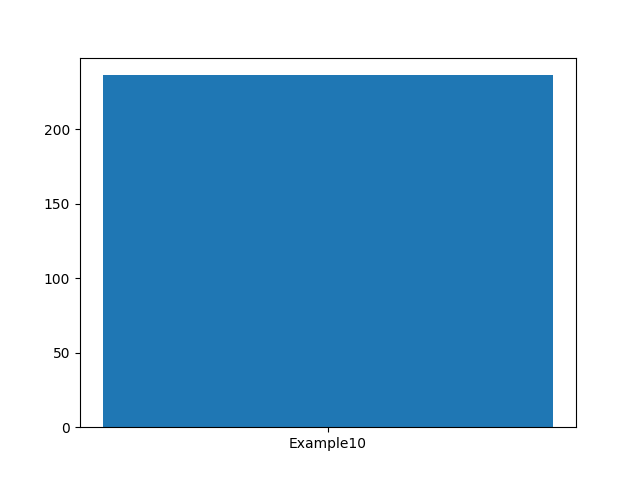
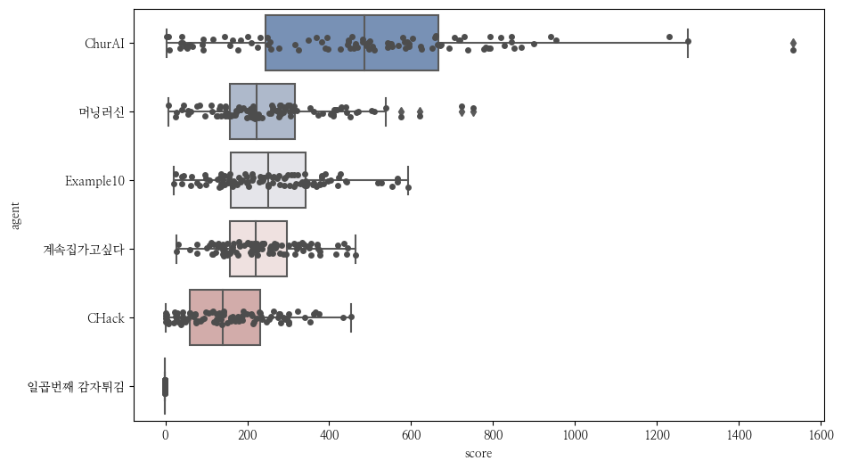
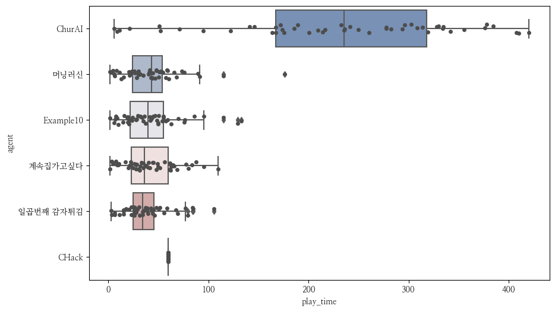
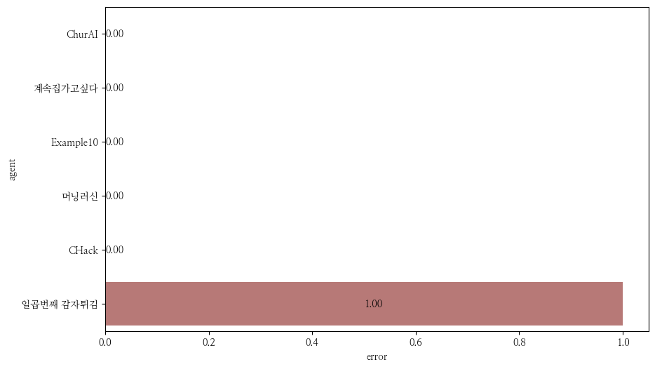

NCF2022 결과
===============
**진행 현황**

.. list-table::
   :header-rows: 1
 
   * - 시작시간
     - 현재시간
     - 경과시간
     - 게임 번호
   * - 2023-02-09T19:50:25.302080
     - 2023-02-10T06:58:25.894529
     - 11:08:00.592449
     - 60부터 159까지

**결과 요약**

.. list-table::
   :header-rows: 1

   * - agent
     - mean score
     - median score
     - play time
     - error ratio
   * - ChurAI
     - 480.290
     - 486.000
     - 209.192
     - 0.000
   * - 머닝러신
     - 259.070
     - 222.500
     - 50.485
     - 0.030
   * - Example10
     - 256.230
     - 250.500
     - 52.656
     - 0.010
   * - 계속집가고싶다
     - 232.310
     - 220.500
     - 58.190
     - 0.010
   * - CHack
     - 154.240
     - 140.000
     - 12.254
     - 0.040
   * - 일곱번째 감자튀김
     - -1.0
     - -1.0
     - -1.0
     - 1.000

- 게임번호 60부터 159까지 결과(최근 게임 결과)만 사용함
- mean score: 평균 점수
- median score: 점수의 중간값
- play time: 평균 게임 플레이 시간

**평균 점수**

**점수 분포**

**플레이 시간 분포**

**에러율**

