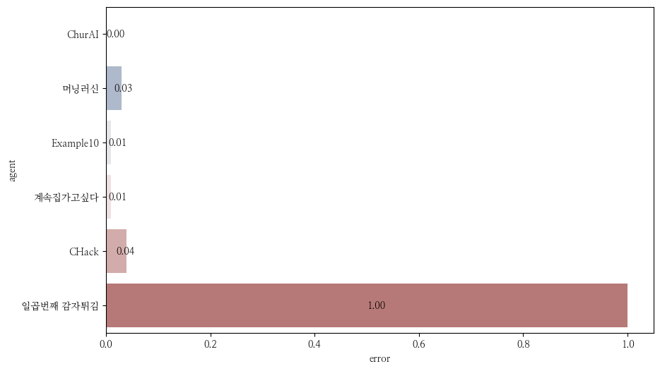

NCF2022 결과
===============
**진행 현황**

.. list-table::
   :header-rows: 1
 
   * - 시작시간
     - 현재시간
     - 경과시간
     - 게임 번호
   * - 2023-02-08T20:42:46.936425
     - 2023-02-08T20:42:56.727512
     - 0:00:09.791087
     - 2부터 6까지

**결과 요약**

.. list-table::
   :header-rows: 1

   * - agent
     - mean score
     - median score
     - play time
     - error ratio
   * - ChurAI
     - 361.200
     - 330.000
     - 162.306
     - 0.000
   * - 계속집가고싶다
     - 325.200
     - 311.000
     - 45.504
     - 0.000
   * - Example10
     - 279.200
     - 290.000
     - 54.155
     - 0.000
   * - 머닝러신
     - 250.000
     - 277.000
     - 68.306
     - 0.000
   * - CHack
     - 231.000
     - 157.000
     - 9.157
     - 0.000
   * - 일곱번째 감자튀김
     - -1.0
     - -1.0
     - -1.0
     - 1.000

- 게임번호 2부터 6까지 결과(최근 게임 결과)만 사용함
- mean score: 평균 점수
- median score: 점수의 중간값
- play time: 평균 게임 플레이 시간

**평균 점수**

.. figure:: fig/mean_score.png
   :figwidth: 200

**점수 분포**

.. figure:: fig/median_score.png
   :figwidth: 200

**플레이 시간 분포**

.. figure:: fig/mean_play_time.png
   :figwidth: 200

**에러율**

