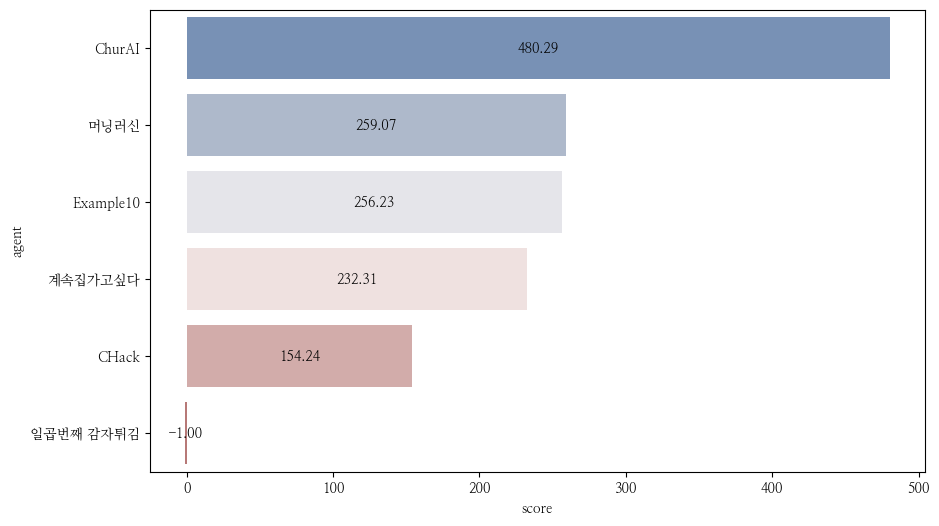

NCF2022 결과
===============
**진행 현황**

.. list-table::
   :header-rows: 1
 
   * - 시작시간
     - 현재시간
     - 경과시간
     - 게임 번호
   * - 2023-02-06T19:57:42.154957
     - 2023-02-06T20:26:12.137081
     - 0:28:29.982124
     - 0부터 2까지

**결과 요약**

.. list-table::
   :header-rows: 1

   * - agent
     - mean score
     - median score
     - play time
   * - 일곱번째 감자튀김
     - 400.667
     - 455.000
     - 79.047
   * - Example10
     - 287.333
     - 393.000
     - 50.045
   * - 계속집가고싶다
     - 292.667
     - 307.000
     - 47.025
   * - 머닝러신
     - 257.333
     - 282.000
     - 38.935
   * - CHack
     - -1.0
     - -1.0
     - -1.0
   * - ChurAI
     - -1.0
     - -1.0
     - -1.0

- 게임번호 0부터 2까지 결과(최근 게임 결과)만 사용함
- mean score: 평균 점수
- median score: 점수의 중간값
- play time: 평균 게임 플레이 시간

**Mean Score**

**Median Score**

**Mean Play Time**

.. figure:: fig/mean_play_time.png
   :figwidth: 200

