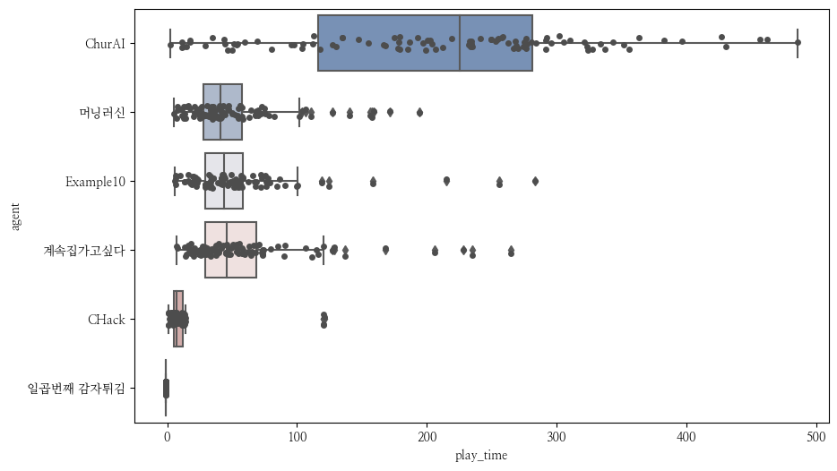

NCF2022 결과
===============
**진행 현황**

.. list-table::
   :header-rows: 1
 
   * - 시작시간
     - 현재시간
     - 경과시간
     - 게임 번호
   * - 2023-02-08T18:08:48.384126
     - 2023-02-08T18:08:57.861656
     - 0:00:09.477530
     - 44부터 93까지

**결과 요약**

.. list-table::
   :header-rows: 1

   * - agent
     - mean score
     - median score
     - play time
   * - ChurAI
     - 489.860
     - 482.500
     - 229.815
   * - 머닝러신
     - 212.780
     - 211.000
     - 43.890
   * - Example10
     - 211.880
     - 203.500
     - 43.670
   * - 계속집가고싶다
     - 203.940
     - 198.500
     - 40.807
   * - 일곱번째 감자튀김
     - 191.160
     - 185.000
     - 37.607
   * - CHack
     - 0.000
     - 0.000
     - 60.005

- 게임번호 44부터 93까지 결과(최근 게임 결과)만 사용함
- mean score: 평균 점수
- median score: 점수의 중간값
- play time: 평균 게임 플레이 시간

**평균 점수**

.. figure:: fig/mean_score.png
   :figwidth: 200

**점수 분포**

.. figure:: fig/median_score.png
   :figwidth: 200

**플레이 시간 분포**

